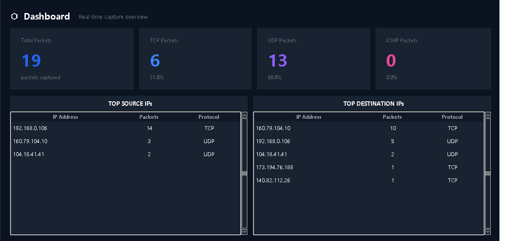
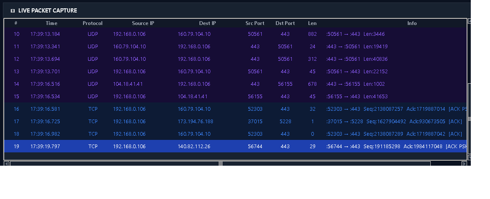
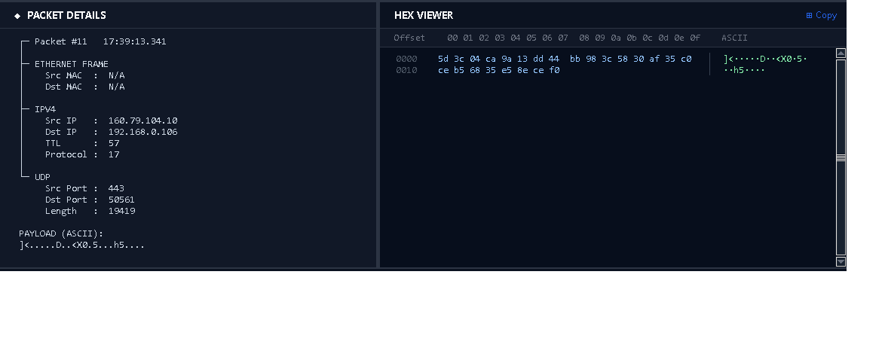
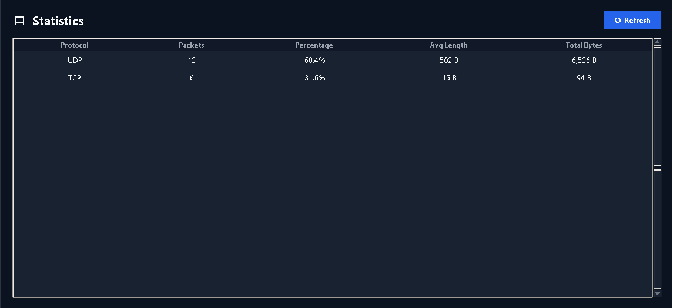

<div align="center">

# NetSniffer Pro

**A professional-grade, dependency-free network packet analyzer built in pure Python**

[](https://www.python.org/)
[]()
[](LICENSE)
[-brightgreen.svg)]()

*A Wireshark-inspired desktop packet sniffer with a modern dark UI, real-time capture, and protocol-aware analysis — built entirely on Python's standard library.*

[Features](#features) • [Screenshots](#screenshots) • [Installation](#installation) • [Usage](#usage) • [Architecture](#architecture) • [Demo](#demo-video)

</div>

---

## Overview

**NetSniffer Pro** is a real-time network packet capture and analysis tool with a polished, Wireshark-style interface — built using nothing but Python's standard library (`tkinter`, `socket`, `struct`, `threading`). It captures live traffic at the raw socket level, parses Ethernet/IPv4/TCP/UDP/ICMP headers byte-by-byte, and presents the results through a responsive, multi-page desktop application.

The entire application lives in a single 1,784-line file (`network_sniffer.py`), demonstrating that a production-quality networking tool doesn't require third-party GUI frameworks or packet libraries like Scapy — just a solid understanding of protocol structures and the standard library.

> **Note:** Raw socket capture requires elevated privileges. Run as Administrator on Windows or with `sudo` on Linux.

## Features

- **Modern Dark UI** — Custom Canvas-based widgets (rounded buttons, animated status indicators) on a carefully designed dark color palette
- **Live Packet Capture** — Background-threaded capture engine keeps the UI fully responsive while sniffing traffic in real time
- **Deep Protocol Parsing** — Manual byte-level parsing of Ethernet, IPv4, TCP, UDP, and ICMP headers (no third-party packet libraries)
- **Protocol-Colored Table** — Packets are color-coded by protocol (TCP, UDP, ICMP, HTTP, HTTPS, DNS, ARP) for instant visual triage
- **Wireshark-Style Hex Viewer** — Byte-accurate hex dump with offset markers and side-by-side ASCII preview, syntax-highlighted by byte value
- **8 Dedicated Pages** — Dashboard, Packets, Statistics, Connections, Logs, Export, Settings, and About
- **Live Search & Filtering** — Full-text search across all packet fields plus protocol filtering (TCP / UDP / ICMP / All)
- **Multi-Format Export** — Export captures to CSV, JSON, or per-packet TXT reports
- **Real-Time Statistics** — Auto-computed protocol distribution, top talkers, and connection aggregation (top 300 5-tuples)
- **Smart Privilege Handling** — Detects admin/root status and offers a one-click UAC relaunch on Windows
- **Zero External Dependencies** — Runs on a stock Python install; no pip packages required

## Screenshots

> *Add your screenshots below once captured — see the [Media Guide](#-adding-screenshots--demo-video) section for exact steps.*

<div align="center">

| Dashboard | Live Packet Capture |
|:---:|:---:|
|  |  |

| Hex Viewer | Statistics |
|:---:|:---:|
|  |  |

</div>

## Demo Video

> *Embed your demo clip here once recorded — GitHub renders an inline player automatically once the video is committed to the repo (see guide below).*

<div align="center">

https://github.com/Md-zakria/NetSniffer-Pro/assets/demo-placeholder

</div>

## Architecture

NetSniffer Pro follows a clean 6-layer single-file architecture:

```
┌─────────────────────────────────────────────────┐
│   LAYER 6 — APPLICATION  (NetworkSnifferGUI)    │
│   8 pages, toolbar, header, statusbar, menus    │
├─────────────────────────────────────────────────┤
│   LAYER 5 — WIDGET LIBRARY                      │
│   ModernButton · PulseDot · Separator           │
│   Sidebar · PacketTable · DetailsPanel          │
│   HexViewer                                     │
├─────────────────────────────────────────────────┤
│   LAYER 4 — THREAD BRIDGE                       │
│   CaptureWorker (Thread) + queue.Queue          │
├─────────────────────────────────────────────────┤
│   LAYER 3 — PROTOCOL PARSERS                    │
│   Ethernet · IPv4 · TCP · UDP · ICMP            │
│   build_packet_record · open/close socket       │
├─────────────────────────────────────────────────┤
│   LAYER 2 — UTILITIES                           │
│   mac_addr · ipv4_addr · payload_preview        │
│   payload_hex_dump · get_capture_ip             │
├─────────────────────────────────────────────────┤
│   LAYER 1 — THEME + CONSTANTS                   │
│   T · PROTO_ROW_BG · PROTO_FG                  │
└─────────────────────────────────────────────────┘
```

**Data flow:** a raw socket feeds a background `CaptureWorker` thread, which parses each packet and pushes structured records through a thread-safe `queue.Queue`. The GUI polls this queue every 100ms and updates the packet table, details panel, hex viewer, statistics, and status indicators in real time — keeping capture and rendering fully decoupled.

| Component | Technology |
|---|---|
| Language | Python 3.14 |
| GUI Framework | Tkinter (stdlib) |
| Concurrency | `threading.Thread` + `queue.Queue` |
| Packet Capture | Raw sockets (`SOCK_RAW`) — `AF_INET`/`IP_HDRINCL` on Windows, `AF_PACKET` on Linux |
| Parsing | Manual `struct.unpack` on Ethernet/IPv4/TCP/UDP/ICMP headers |

## Requirements

- Python 3.10+ (developed and tested on Python 3.14)
- **Windows:** Administrator privileges (the app offers an automatic UAC relaunch)
- **Linux:** root privileges (run with `sudo`)
- No external packages required — built entirely on the standard library

## Installation

```bash
# Clone the repository
git clone https://github.com/Md-zakria/NetSniffer-Pro.git
cd NetSniffer-Pro

# No pip install needed — stdlib only
```

## Usage

**Windows:**
```bash
python network_sniffer.py
```
The app detects whether it's running with admin rights; if not, it prompts to relaunch with a UAC dialog.

**Linux:**
```bash
sudo python3 network_sniffer.py
```

### Quick Start
1. Launch the app — it opens on the **Packets** page by default
2. (Optional) Set a protocol filter (TCP / UDP / ICMP) or a max packet cap in the toolbar
3. Click **▶ Start** to begin live capture
4. Select any row to inspect its full header breakdown in the **Details Panel** and raw bytes in the **Hex Viewer**
5. Use **⇥ Export** to save the session as CSV or JSON, or visit the **Statistics**/**Connections** pages for aggregated insights

## Project Structure

```
NetSniffer-Pro/
├── network_sniffer.py          # Main application (single-file, 1,784 lines)
├── NetSniffer Pro.lnk          # Windows launcher (Run as Admin flag set)
├── requirements.txt            # Listed, not required at runtime
├── sniffer_log.txt             # Auto-generated capture log
├── network_sniffer/            # Modular scaffold (not used at runtime)
└── .vscode/                    # Editor configuration
```

## Known Limitations

- No DNS resolution of captured IP addresses
- No ARP packet parsing (ARP frames are currently skipped)
- No `.pcap` import/export support
- No manual network interface selection
- No live charts (Statistics page is table-based)
- Read-only sniffer — no packet injection, modification, or TLS decryption

## Roadmap

- [ ] PCAP file export/import compatibility
- [ ] ARP packet parsing and visualization
- [ ] Reverse DNS resolution toggle
- [ ] Interface selection dropdown
- [ ] Live bandwidth/throughput graphing

## Contributing

Contributions, issues, and feature requests are welcome. Feel free to open an issue or submit a pull request.

## License

This project is licensed under the MIT License — see the [LICENSE](LICENSE) file for details.

## Author

**Muhammad Zakria**
BS Cybersecurity Student, COMSATS University Islamabad
[GitHub](https://github.com/Md-zakria) • [LinkedIn](https://linkedin.com/in/muhammad-zakria-9914a0325)

---

<div align="center">

If you found this project useful, consider giving it a star.

</div>
